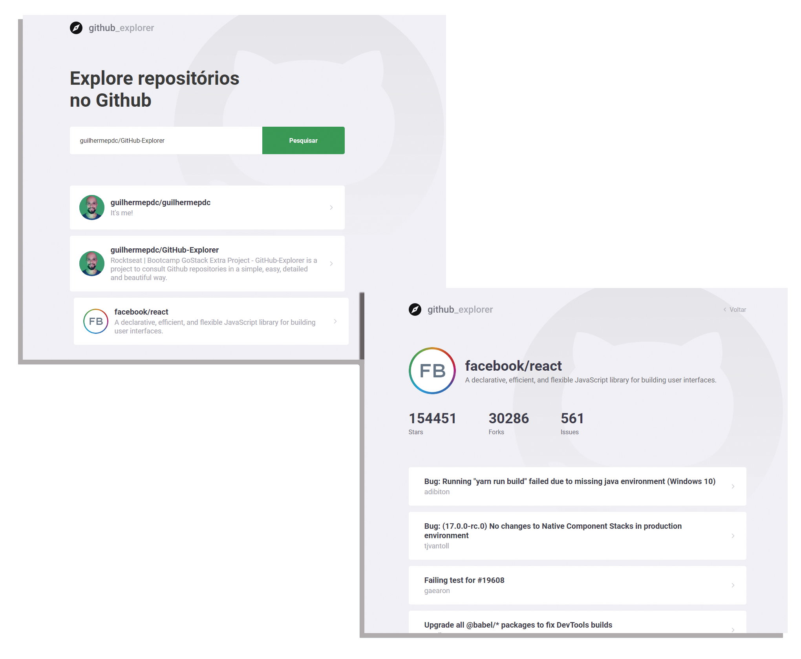

<h1 align="center">
    
</h1>

<h4 align="center">
  Explore amazing Github Repositories. Built with ReactJS and Styled Components.
</h4>

<p align="center">
  <a href="#rocket-technology">Technology</a>&nbsp;&nbsp;&nbsp;|&nbsp;&nbsp;&nbsp;
  <a href="#-project">Project</a>&nbsp;&nbsp;&nbsp;|&nbsp;&nbsp;&nbsp;
  <a href="#installation">Installation</a>&nbsp;&nbsp;&nbsp;|&nbsp;&nbsp;&nbsp;
  <a href="#memo-License">License</a>
</p>

<br>

<p align="center">
  
</p>

## :rocket: Technology

This project was developed with the following technologies:

- [ReactJS](https://reactjs.org/)
- [TypeScript](https://www.typescriptlang.org/)
- [React Router DOM](https://reacttraining.com/react-router/)
- [React Icons](https://react-icons.netlify.com/#/)
- [Styled Components](https://styled-components.com/)
- [Axios](https://github.com/axios/axios)
- [Eslint](https://eslint.org/)
- [Prettier](https://prettier.io/)
- [EditorConfig](https://editorconfig.org/)

## 💻 Project

Github-Explorer is a project to consult Github repositories in a simple, easy, detailed and beautiful way.

## 💻 Installation

First of all, you may clone this repo 

```
  git clone  git clone https://github.com/guilhermepdc/Github-Explorer.git
```

Run the following scripts in order to execute the application in development mode 

```
  // Install the dependencies
  yarn install
  
  // Start the application
  // yarn start
```
## :memo: License

This project is under the MIT license. See the archive [LICENSE](LICENSE.md) for more details.

---

Made with ♥ by Rocketseat :wave: [Join the community!](https://discordapp.com/invite/gCRAFhc)